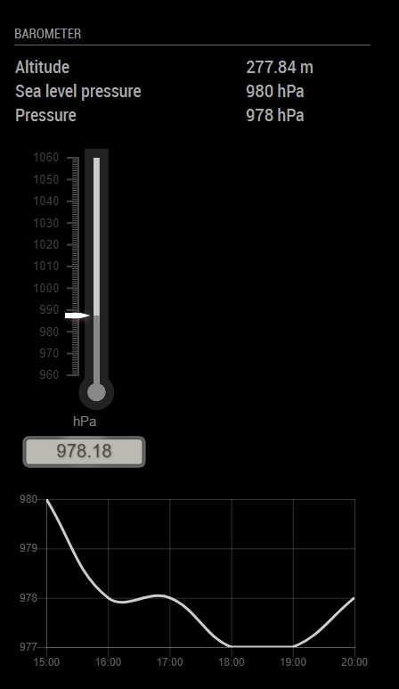
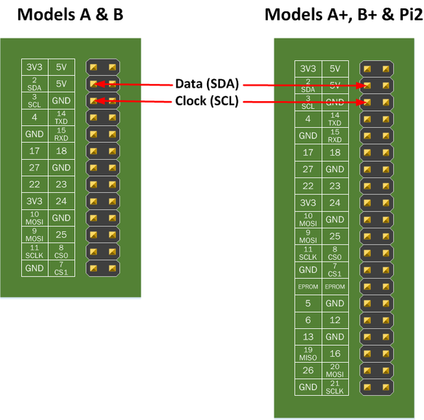
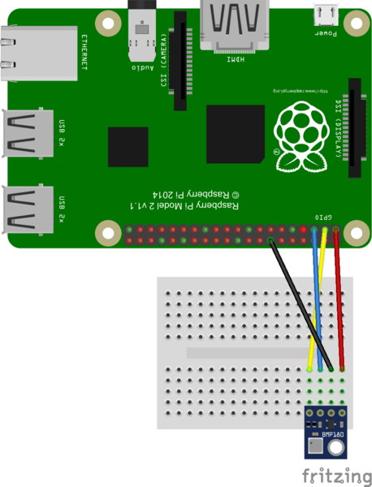

# MMM-BMP-sensor

Magic mirror barometer module based on Adafruit BMP sensor.

<p align="center">
    
</p>

## Installation

Install the python lib
```bash
git clone https://github.com/adafruit/Adafruit_Python_BMP
cd Adafruit_Python_BMP
sudo python setup.py install
```

Install this module by cloning it into your Magic Mirror module directory
```
cd modules
git clone https://github.com/Sispheor/MMM-BMP-sensor.git
cd MMM-BMP-sensor
npm install
```

Configure your `~/MagicMirror/config/config.js`:
```
{
    module: "MMM-BMP-sensor",
    header: "Barometer",
    position: "top_left",
    config: {
        showPressureRow: false,
        temperatureUnit: "metric",
        timeLimitKeepBmpData: "8h",
        updateInterval: "1h"
    }
}
```


## Configuration options

| Option                  | Default | Description                                                                                                                          |
|-------------------------|---------|--------------------------------------------------------------------------------------------------------------------------------------|
| updateInterval          | 1h      | Interval before the module try to get a new value from the sensor. Each new value are placed in the database and the view is updated |
| timeLimitKeepBmpData    | 6h      | Cleanup database from old value after this interval. By default the module keep 6 hours of data.                                     |
| debug                   | false   | If True, debug print are displayed in the console                                                                                    |
| showTableBmpInfo        | true    | If true, the table that contains info about temparature, altitude, seal level pressure and pressure will be displayed on the screen  |
| showTemperatureRow      | true    | If true, the line that concerns the temperature will be displayed in the info table                                                  |
| showAltitudeRow         | true    | If true, the line that concerns the altitude will be displayed in the info table                                                     |
| showSeaLevelPressureRow | true    | If true, the line that concerns the altitude will be displayed in the info table                                                     |
| showPressureRow         | true    | If true, the line that concerns the current pressure will be displayed in the info table                                             |
| showGauge               | true    | Display or not the pressure gauge                                                                                                    |
| showChart               | true    | Display or not the chart with all data bellow the timeLimitKeepBmpData                                                               |
| chartTimeUnit           | hour    | Unit of the chart. Can be millisecond, second, minute, hour, day, week, month, quarter, year                                         |
| temperatureUnit         | metric  | metric = Celsius, imperial =Fahrenheit                                                                                               |

`updateInterval` is composed by an integer followed by a letter "s" or "m" or "h" or "d"

Example of `updateInterval`:
- **1h**: get new barometer metrics every hour
- **4h**: get new barometer metrics every 4 hours
- **30m**: get new barometer metrics every 30 minutes

## Database clean

You clean get a fresh database by deleting the file `/tmp/mmm-bpm-datastore`

## Hardware configuration

### Active I2C

The BMP180 is an i2c board. The diagram below shows the location of the i2c pins on the Raspberry Pi.

<p align="center">
    
</p>

Installed required packages
```
sudo apt-get install i2c-tools
sudo apt-get install python-smbus
```

Run `sudo raspi-config` and active the i2c support from **Interfacing Options --> I2C --> Enable**

Then reboot your Rpi to take effect.

### Plugging in the BMP180

The diagram below show how to connect the BMP180 to your Pi.

<p align="center">
    
</p>


| Name | Cable color | Description  |
|------|-------------|--------------|
| 3.3V | RED         | Power supply |
| SDA  | YELLOW      | Data         |
| SCL  | BLUE        | clock signal |
| GND  | BLACK       | Ground       |


Then, type the following to check that your BMP sensor is well recognized
```
sudo i2cdetect -y 1
```

Example output, here the BMP sensor is using address 0x77.
```
     0  1  2  3  4  5  6  7  8  9  a  b  c  d  e  f
00:          -- -- -- -- -- -- -- -- -- -- -- -- --
10: -- -- -- -- -- -- -- -- -- -- -- -- -- -- -- --
20: -- -- -- -- -- -- -- -- -- -- -- -- -- -- -- --
30: -- -- -- -- -- -- -- -- -- -- -- -- -- -- -- --
40: -- -- -- -- -- -- -- -- -- -- -- -- -- -- -- --
50: -- -- -- -- -- -- -- -- -- -- -- -- -- -- -- --
60: -- -- -- -- -- -- -- -- -- -- -- -- -- -- -- --
70: -- -- -- -- -- -- -- 77
```
